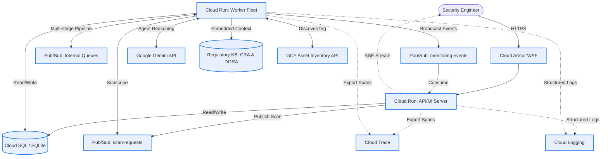
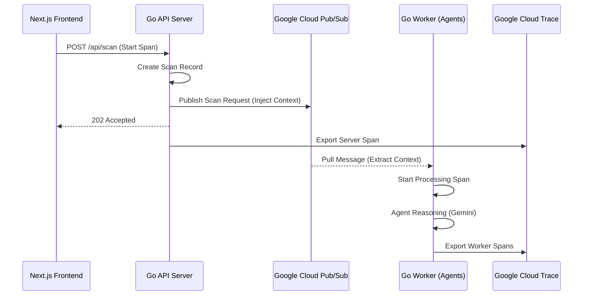
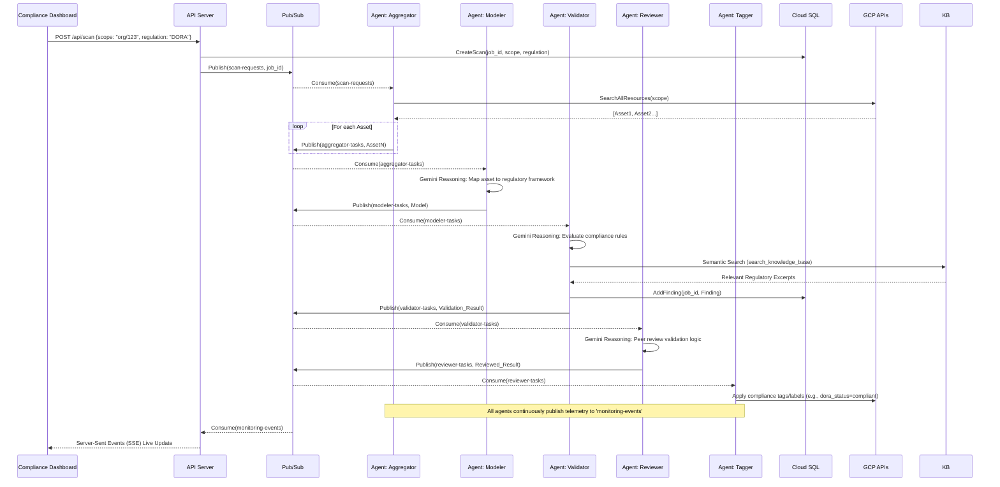

# System Architecture & Security Design

This document describes the technical architecture of the Multi-Agent Regulatory Compliance System (supporting CRA and DORA).

### [Deployment Instructions](https://github.com/iuriikogan/Audit-Agent/blob/main/DEPLOY.md)

## High-Level System Architecture

The system is deployed as a single compiled Go binary that adapts its behavior based on the `ROLE` environment variable, enabling independent scaling of the API/UI and background processing workloads on Google Cloud Run.

## Observability & Distributed Tracing

The system implements full-stack observability using OpenTelemetry to provide end-to-end visibility into the asynchronous, multi-agent workflows.

### Distributed Tracing Flow

Trace context is propagated across service boundaries (including Pub/Sub) to maintain a single trace for each compliance assessment.

### Log-Trace Correlation

By injecting `logging.googleapis.com/trace` and `logging.googleapis.com/spanId` into structured JSON logs, the system enables seamless navigation between logs and traces in the Google Cloud Console. This is critical for debugging the asynchronous behavior of the multi-agent pipeline.

## Agent Pipeline & Data Flow

The compliance process is a multi-stage, event-driven pipeline where autonomous AI agents perform specific roles.

## Security Controls

1.  **Secure Configuration Management:** No secrets (API keys, DB credentials) are stored in code or configuration files. They are injected exclusively via environment variables at runtime, sourced from Google Secret Manager.
2.  **Least Privilege Execution (Identity-Based Security):**
    *   The system uses dedicated Google Service Accounts (defined in `iam.tf`) for different stages:
        *   `compliance-server-sa`: Used by the API/UI server with access to Cloud SQL and Secrets.
        *   `compliance-worker-sa`: Used by the background worker with access to Vertex AI, Cloud Asset API, Cloud SQL, and Secrets.
        *   Agent-Specific Accounts (`sa-classifier`, `sa-auditor`, `sa-vuln`, `sa-reporter`): Available for fine-grained execution where individual agents run in isolated contexts.
    *   **Pub/Sub Push Authentication**: All internal agent communication uses Pub/Sub **Push Subscriptions** with OIDC token authentication. The worker services validate these tokens, ensuring that only the authorized Pub/Sub service can trigger agent logic.
3.  **Network Isolation:** 
    *   **Private Cloud SQL**: The mySQL database is deployed with a private IP within a Virtual Private Cloud (VPC), inaccessible from the public internet.
    *   **Serverless VPC Access**: Cloud Run services use a dedicated VPC Connector to securely reach the private database.
4.  **Ingress Protection:**
    *   The **Worker Fleet** is configured with `ingress = internal`, preventing direct access from the public internet.
    *   The **Server** is accessible publicly but protected by Google Cloud Armor (WAF and DDoS protection).
    *   **Model Armor** integration inspects incoming requests for prompt injection or jailbreak attempts before they reach the Gemini AI agents.

## State Management

The system abstracts state management through a `Store` interface, allowing flexibility based on deployment needs:

*   **Cloud SQL** Used for production. Provides robust, concurrent transaction support and complex querying capabilities for the CRA Dashboard. Database connections are secured via SSL and private IP.
*   **SQLite (In-Memory):** Used for local development and CI/CD pipelines. It provides a zero-dependency, ephemeral database that perfectly mimics the relational structure of Cloud SQL.

The frontend dashboard queries this state via the `/api/findings` endpoint, pulling historical compliance data independently of the real-time Pub/Sub pipeline.
