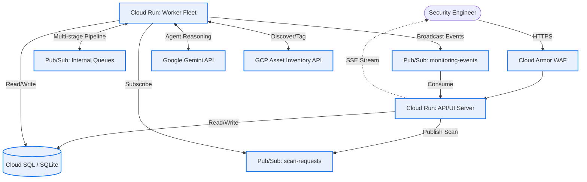
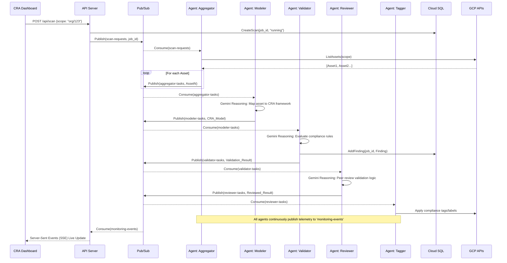

# System Architecture & Security Design

This document describes the technical architecture of the Multi-Agent Cyber Resilience Act (CRA) Compliance System.

## High-Level Deployment Architecture

The system is deployed as a single compiled Go binary that adapts its behavior based on the `ROLE` environment variable, enabling independent scaling of the API/UI and background processing workloads on Google Cloud Run.

## Agent Pipeline & Data Flow

The compliance process is a multi-stage, event-driven pipeline where autonomous AI agents perform specific roles.

## Security Controls

1.  **Strict 12-Factor Configuration:** No secrets (API keys, DB credentials) are stored in code or configuration files. They are injected exclusively via environment variables at runtime, sourced from Google Secret Manager.
2.  **Least Privilege Execution:**
    *   The `server` role requires only database access and Pub/Sub publish rights.
    *   The `worker` role operates under a dedicated Service Account with specific permissions to read Cloud Asset Inventory and apply Resource Tags. It does not expose any inbound network ports.
3.  **Network Isolation:** 
    *   The Cloud SQL database is deployed with a private IP within a Virtual Private Cloud (VPC), inaccessible from the public internet.
    *   Serverless VPC Access connectors route traffic from Cloud Run to the private database.
4.  **Ingress Protection:**
    *   Google Cloud Armor sits in front of the API server, providing WAF and DDoS protection.
    *   **Model Armor** integration inspects incoming requests for prompt injection or jailbreak attempts before they reach the Gemini AI agents.

## State Management

The system abstracts state management through a `Store` interface, allowing flexibility based on deployment needs:

*   **Cloud SQL (PostgreSQL):** Used for production. Provides robust, concurrent transaction support and complex querying capabilities for the CRA Dashboard.
*   **SQLite (In-Memory):** Used for local development and CI/CD pipelines. It provides a zero-dependency, ephemeral database that perfectly mimics the relational structure of Cloud SQL without requiring a running database server.

The frontend dashboard queries this state via the `/api/findings` endpoint, pulling historical compliance data independently of the real-time Pub/Sub pipeline.