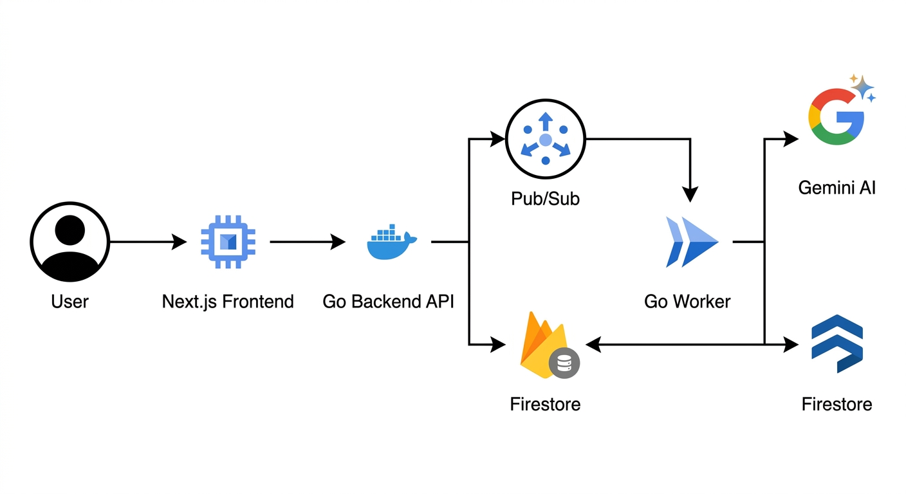
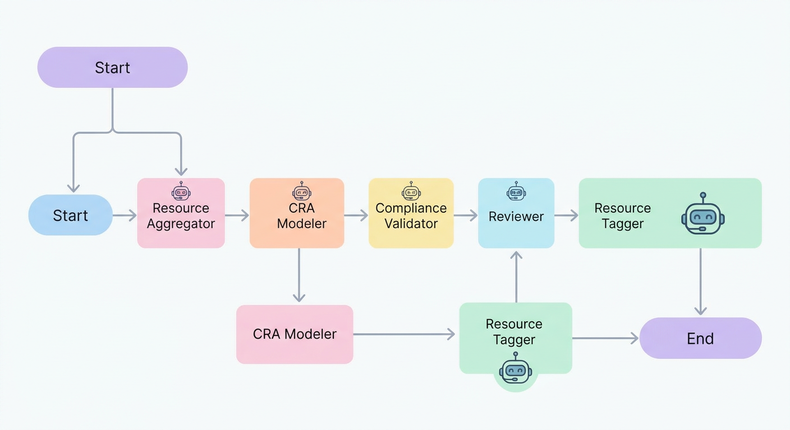

# Multi-Agent CRA Security Platform

[](https://opensource.org/licenses/MIT)

A scalable, event-driven multi-agent system designed to assess Google Cloud infrastructure against the **Cyber Resilience Act (CRA)**.

## 🚀 Features

*   **Autonomous Agents:** Specialized AI agents for Discovery, Modeling, Validation, and Reporting.
*   **Event-Driven:** Decoupled architecture using Google Cloud Pub/Sub.
*   **Unified Deployment:** Backend API and Frontend Dashboard served from a single, scalable Cloud Run service.
*   **AI-Powered:** Leverages Gemini 1.5 Pro for deep reasoning and compliance mapping.
*   **Infrastructure as Code:** Full Terraform setup included.
*   **Security:** Google Cloud Armor ready (Model Armor for AI protection).

## 🏗️ System Architecture



The system is composed of the following key components:

1.  **Unified Server (Go):** 
    *   Hosts the **REST API** for triggering scans.
    *   Serves the **React/Next.js Dashboard** (static export) directly.
    *   Handles authentication and audit logging.
2.  **Worker (Go):** An autonomous worker service that consumes scan requests from Pub/Sub, orchestrates the AI agents, and performs the actual compliance assessments.
3.  **Pub/Sub:** Acts as the asynchronous message bus, decoupling the API server from the heavy processing in the workers.
4.  **Firestore:** Stores scan results, compliance reports, and audit logs.
5.  **Gemini AI:** The reasoning engine used by the agents to analyze infrastructure and determine compliance.

### Agent Workflow



The compliance process is driven by a chain of specialized agents:

*   **Resource Aggregator:** Discovers and ingests GCP assets.
*   **CRA Modeler:** Applies the CRA compliance framework to the data.
*   **Compliance Validator:** Validates the model against regulatory rules.
*   **Reviewer:** Provides final approval and summary of the report.
*   **Resource Tagger:** Tags resources with compliance status and remediation steps.

## 📂 Project Structure

```
├── cmd/
│   ├── server/      # API Server + Static File Server
│   └── worker/      # Agent Orchestration Worker
├── pkg/             # Shared libraries (Agents, Core, Config)
├── web/             # Next.js Frontend Dashboard
├── terraform/       # IaC definitions
└── cloudbuild.yaml  # CI/CD Pipeline
```

## 🛠️ Prerequisites

*   Go 1.25+
*   Node.js 20+ (for frontend build)
*   Google Cloud Project with Billing enabled
*   `gcloud` CLI installed and authenticated
*   `terraform` installed
*   Gemini API Key
*   Docker & Docker Compose

### Quick Start (Local Development)

We provide a `Makefile` and `docker-compose` setup for easy local development.

1.  **Configure Environment:**
    ```bash
    cp .env.example .env
    # Edit .env and set your GEMINI_API_KEY and PROJECT_ID
    ```

2.  **Start Services:**
    ```bash
    make start
    ```
    This will spin up:
    *   **Dashboard & API:** http://localhost:8080
    *   **Pub/Sub Emulator:** http://localhost:8085
    *   **Firestore Emulator:** http://localhost:8081

3.  **Trigger a Scan:**
    Go to the dashboard or use cURL:
    ```bash
    curl -X POST http://localhost:8080/api/scan -d '{"scope": "projects/my-project"}'
    ```

### Production Deployment (Cloud Run)

Use the provided build script to deploy the entire stack to Google Cloud Run. This handles the multi-stage build (Frontend -> Embedded -> Server Container) automatically.

```bash
./build.sh
```

**What happens:**
1.  Frontend is built (`npm run build`).
2.  Go Server is built with embedded frontend assets.
3.  Worker image is built.
4.  Both services (`cra-server`, `cra-worker`) are deployed to Cloud Run.

### Post-Deployment: Security Configuration

The system uses **Google Cloud Armor** with **Model Armor** to protect the AI agents. This must be configured manually in the Google Cloud Console to allow for fine-tuning.

1.  Navigate to **Network Security** > **Cloud Armor**.
2.  Create a new policy named `agent-armor-policy`.
3.  Enable **Model Armor** (AI/LLM Protection) rules to block prompt injection and other attacks.
4.  Attach this policy to the `cra-server` service.

See [SECURITY.md](SECURITY.md) for detailed instructions.

## 🧪 Testing

```bash
make test
```