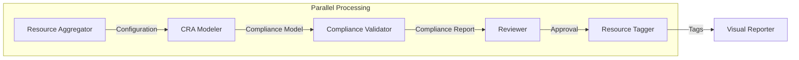

# Multi-Agent CRA System

This project implements a Multi-Agent System (MAS) for EU Cyber Resilience Act (CRA) compliance using Go and Google's Gemini API.

## Architecture

The system employs a sequential pipeline of specialized agents, orchestrated to assess cloud infrastructure compliance.



### Agents

1.  **Resource Aggregator (Specialist)**
    *   **Role:** Discovers and ingests asset configurations.
    *   **Tools:** `list_gcp_assets`, `ingest_file_system`
    *   **Model:** `gemini-3.1-flash-lite-preview`

2.  **CRA Modeler (Reasoning)**
    *   **Role:** Maps technical configurations to CRA compliance requirements.
    *   **Model:** `gemini-3-pro-preview`

3.  **Compliance Validator (Checker)**
    *   **Role:** Validates the model against specific regulations.
    *   **Tools:** `read_cra_regulation_text`, `generate_conformity_doc`
    *   **Model:** `gemini-3-pro-preview`

4.  **Reviewer (Reasoning)**
    *   **Role:** Provides final approval and summaries.
    *   **Model:** `gemini-3-pro-preview`

5.  **Resource Tagger (Specialist)**
    *   **Role:** Generates remediation tags for non-compliant resources.
    *   **Tools:** `apply_resource_tags`
    *   **Model:** `gemini-3.1-flash-lite-preview`

6.  **Visual Reporter (Specialist)**
    *   **Role:** Generates visual dashboards of the compliance status.
    *   **Tools:** `generate_visual_dashboard`
    *   **Model:** `gemini-3-pro-preview` (invoking image generation)

## Usage

1.  Set your API Key: `export GEMINI_API_KEY=your_key`
2.  Run the orchestrator:
    ```bash
    go run cmd/main.go --project=my-gcp-project --log-level=INFO
    ```

### Flags

*   `--role`: (Optional) Run a specific agent role (server mode).
*   `--mode`: Execution mode (`batch` or `server`). Default: `batch`.
*   `--project`: Target GCP Project ID.
*   `--folder`: Target GCP Folder ID.
*   `--org`: Target GCP Organization ID.
*   `--log-level`: Set logging verbosity (`DEBUG`, `INFO`, `WARN`, `ERROR`).